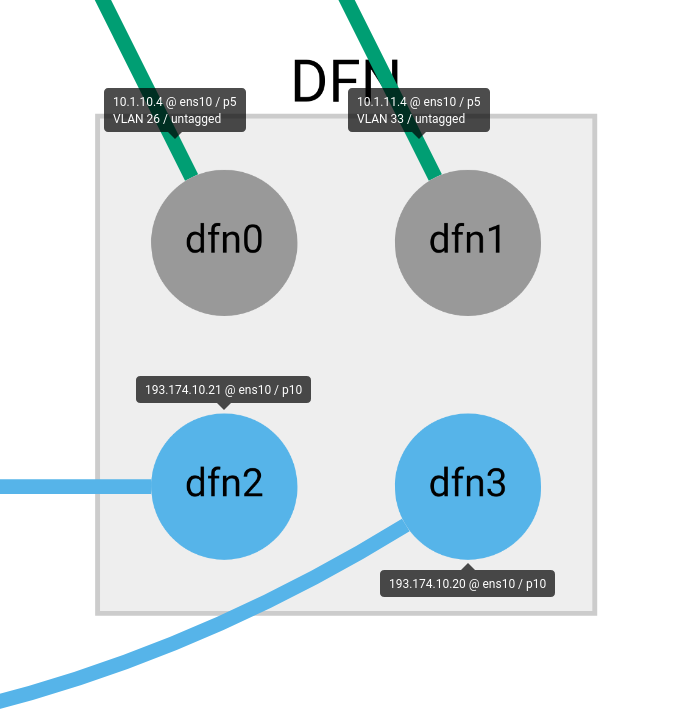

# DFN Setup



Setup of machines in DFN

> Download the helper tool (prebuilt available for x64 linux) https://github.com/fin-ger/gts-port-cfg or build it yourself if not provided for your system, further instrucions can be found in the accompanying README.

1. Create a network configuration (Explained in the README)
2. Generate the DSL for your configuration
```bash
$ gts-port-cfg -d <path to your config>
``` 
3. Create on the DFN Page (https://dfn-gvs.de) a new topology (in `TYPES` click `Add`) and paste the generated DSL in the textfield
4. Done and reserve the created topology
5. After creation you'll have to use the GVS interface to get the IPs of the machines created
6. Once you retrieved all assigned IPs add them to ip field of your configuration

Once you've completed this we can setup the machines.

## Connect to the DFN VPN

For the initial setup it is required to connect to the machines via the maintenance network. The connection information can be found in the information field in GVS on the top right.

> Be aware that the VPN uses `PPTP` the protocol is inherently insecure.

```bash
$ pptpsetup --create dfn --server <DFN IP> --username scionlab --password <DFN password> --encrypt
```
> https://wiki.archlinux.org/index.php/PPTP_Client

## Host Configuration

Currently the configuration is solved by adding the generated script via a systemd service to the startup. An example service can be found in `./services`.
To use the service as intended move it to `/etc/systemd/system` and 
```bash
# systemctl enable scion-l3network.service
```

To execute it instantly
```bash
# systemctl start scion-l3network.service
```
