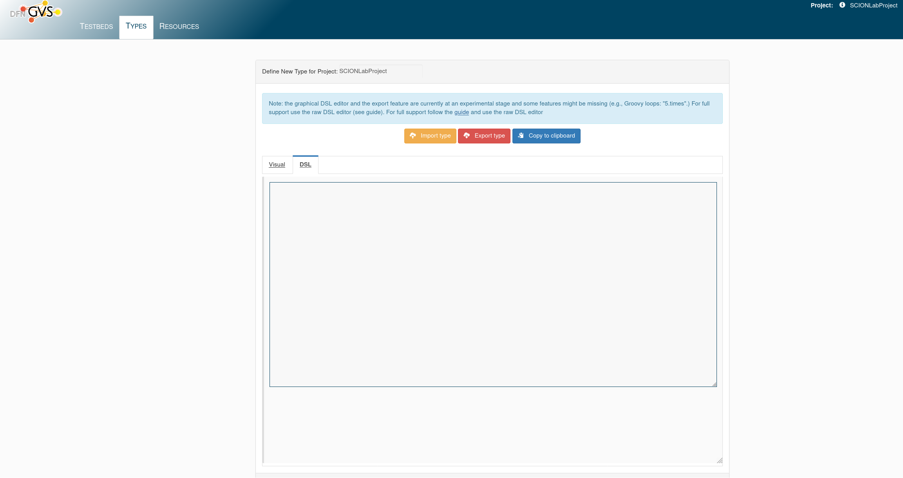
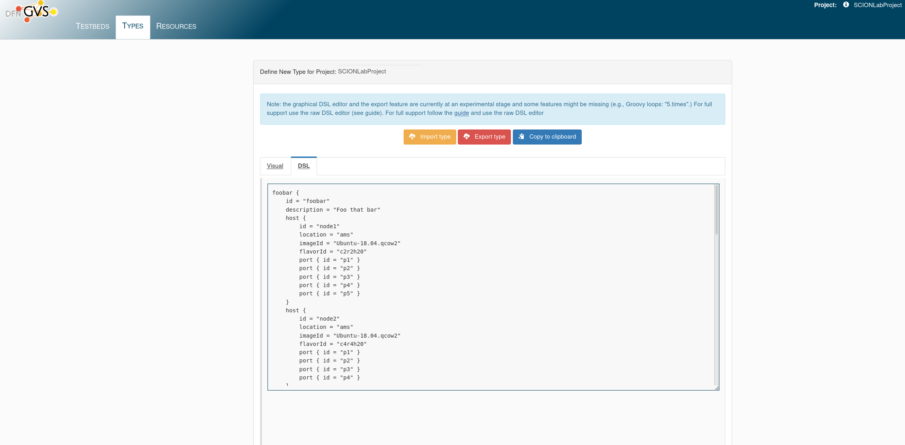
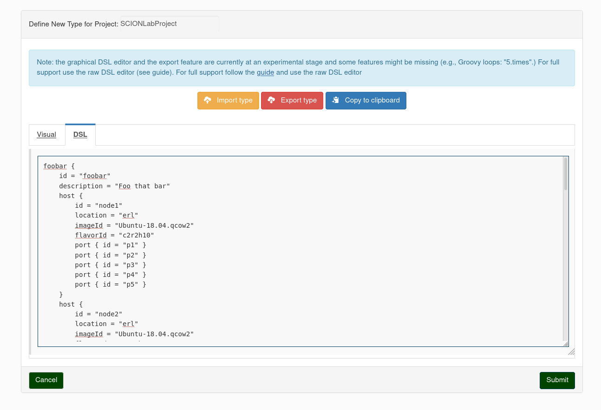
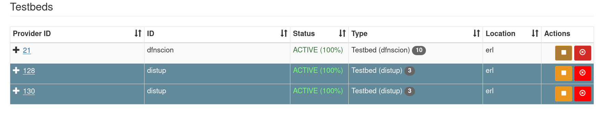

# DFN

The DFN testbed uses the GTS service for the creation of machines in their network. Though we use virtual machines in the DFN deployment instead of
Bare Metal Servers, compared to GTS. For that there is the option to use a, for this purpose created, tool which generates GTS configurations and
scripts for use on the machines.  This short manual will explain the basic steps to achieve a setup.

## Create a DFN Account

Registration can be completed via the [DFN webpage](https://dfn-gvs.de/login#register) and have to be part of the SCIONLab.

!!! info
    For further information what you require ask the current maintainer of the fed4fire SCIONLab project.

## Generate a Testbed Configuration

To generate a testbed configuration use the provided tool [gts-port-cfg](https://github.com/fin-ger/gts-port-cfg). Releases are available for the
linux-x64 platform, additionally the tool can be build for FreeBSD, NetBSD, MacOS, and Windows, though you need to build the project yourself, a short
instruction can be found the accompanying `README.md`

The generation is configuration driven , an example can be found below. The general schema has this form:

```yaml
testbed:
  id: <String>
  description: <String>
  network: <ip-address>
  hosts:
    - hostname: <String>
      ip: <ip-address>
      location: <String>
      # the properties below are optional and generally not required to be set
      # defaults will be used if not given
      flavor: <String>
      image: <String>
      free_ports: <Number>
```

For the first step you may not know the IPs as they are assigned initially by the DFN DHCP, we'll show how to determine later on, for now enter
arbirtary IPs here.

To get the GTS DSL now run:
```
$ ./gts-port-cfg -d <path_to_your_config>
```

### Example configuration:
```yaml
testbed:
  # the identifying name of the testbed in the GTS interface
  id: foobar
  # short description of the purpose of the testbed
  description: Foo that bar
  # The address space to use for the internal full-mesh
  network: 10.42.42.0
  # list of hosts included in the testbed
  # Between these a full-mesh network will be created
  # Required fields: hostname, ip, location
  # For a complete list of available check the testbed creation of the GTS interface
  hosts:
    - hostname: node1
      ip: 172.16.0.108
      location: ams
      free_ports: 1
    - hostname: node2
      ip: 172.16.0.109
      location: ams
      flavor: c4r4h20
    - hostname: node3
      ip: 172.16.0.106
      location: ham
      image: FreeBSD-11.qcow2
    - hostname: node4
      ip: 172.16.0.107
      location: ams
```


## Load the Testbed Configuration and Run it

  With the config generated login on [DFN-GVS](https://dfn-gvs.de) and go to the `Types` tab, and click `Add` in the top right.

  You'll see a textfield in which you can copy your configuration.
  

  Insert the output of `gts-port-cfg` into the text field (here the example from above will be used again)
  
  
  
  Click submit and you'll get referred to the `Types` tab again, with the new configuration in place now.
  
  
  
  Reserve the resources and wait for them to get allocated. The allocated testbed can then be found in the `Testbeds` tab.

  When all the machines are running, indicated by the `Status` in the testbed information, you are free to proceed to the next section.
  
  
  
  
!!! TODO

## Configure DFN Machines

### Retrieve the assigend IPs

To get all the assigned IPs, you'll need to connect via the provided VNC interface to every host.

### Connect to the DFN VPN

For the initial setup it is required to connect to the machines via the maintenance network. The connection information can be found in the information field in GVS on the top right.

!!! warning
    [Be aware that the VPN uses `PPTP`, the protocol is inherently insecure.](https://wiki.archlinux.org/index.php/PPTP_Client)

```bash
$ pptpsetup --create dfn --server <DFN IP> --username scionlab --password <DFN password> --encrypt
```

!!! TODO

## Updating a DFN Machine

!!! TODO
