# ExoGeni

The ExoGeni testbeds are managed with the Flukes tool. In order to use Flukes, you need a recent java installation and `javaws` which is available over the `icedtea-web` package if not included in the default java installation.

## Create a Fed4Fire Account

Visit [https://portal.fed4fire.eu/](https://portal.fed4fire.eu/) to register for a Fed4Fire account. Create a request to join the `scion` project and wait for approval.

## Setup Flukes for Testbed Deployment

When the Fed4Fire account was successfully created, visit the dashboard and locate the `Download Login Certificate (PEM)` button at the bottom of the page. Save the certificate to your local home directory.

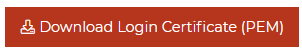

Next, download Flukes `jnlp` file:

```
$ wget http://geni-images.renci.org/webstart/flukes.jnlp
```

Now create the file `~/.flukes.properties` in your home directory with the following contents:

```
orca.xmlrpc.url=https://geni.renci.org:11443/orca/xmlrpc
user.certfile=/path/to/my/certificate.pem
user.certkeyfile=/path/to/my/certificate.pem
enable.modify=true
ssh.key=~/.ssh/id_dsa
# SSH Public key to install into VM instances
ssh.pubkey=~/.ssh/id_dsa.pub
# Secondary login (works with ssh.other.pubkey)
ssh.other.login=yourname
# Secondary public SSH keys 
ssh.other.pubkey=~/.ssh/id_dsa.pub
# Should the secondary account have sudo privileges
ssh.other.sudo=yes
# Path to XTerm executable on your system
xterm.path=/usr/bin/xterm
```

Set `user.certfile`, `user.certkeyfile`, and `ssh.other.login` accordingly. Additionally, you may want to enter another SSH key than your default one, as Flukes only supports a maximum key length of 1024.

After saving the configuration you can start Flukes with:

```
$ javaws /path/to/flukes.jnlp
```

This will download Flukes and might take a while. If Flukes asks for a password for your PEM file, enter the password you used for your Fed4Fire account.

## Load the Testbed and Run it

When everything is properly setup, Flukes should finally open with an empty screen.

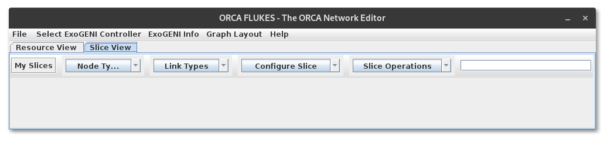

Now, download the [default ScionLab Flukes configuration](../deployments/flukes.ndl) and load it into Flukes like this:

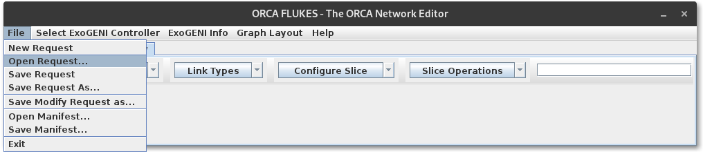

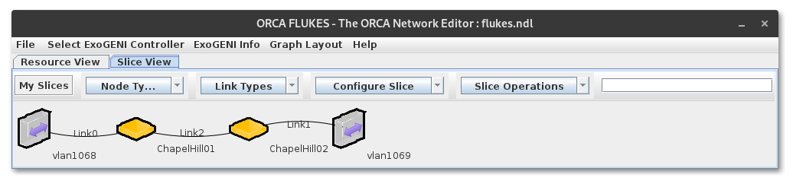

In order to open the submenus in the toolbar you have to precisely click on the arrows of the dropdown menus. Otherwise, the menus won't open. Also note, that the menu items won't highlight when hovering them. Just click on them and it will eventually work. Be patient, it might take some time...

To configure the duration for which the experiment should run, go to `Configure Slice` / `Reservation Details` and enter the desired duration.

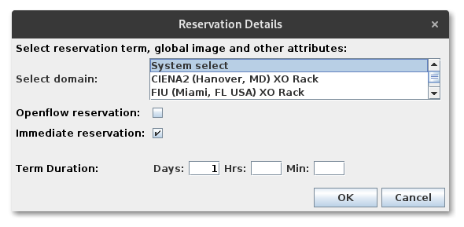

To run your experiment first give it a name and then click on `Slice Operations` / `Submit Changes`.

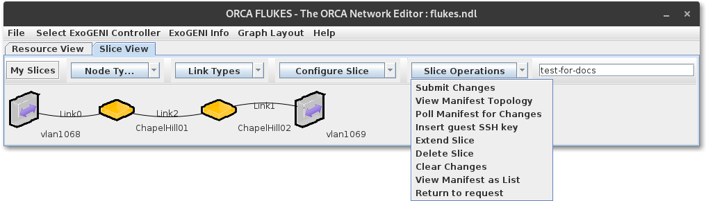

After the changes got submitted, Flukes will try to get the resources up and ready. To view the progress on this, click on `My Slices` and select your slice and hit `Query`.

!!! info
    You can also use the `Query` feature of Flukes to check the status of any runing slice you have access to.

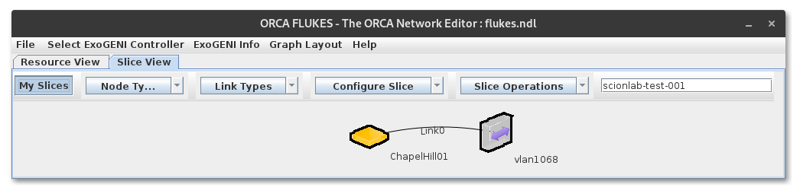
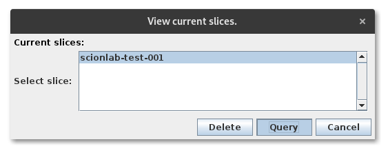
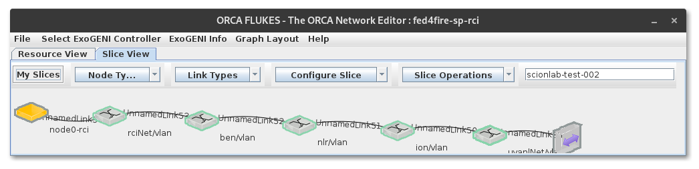

!!! note
    The testbed creation is **very** fragile!!! Make sure **all** links and nodes you entered in your request are fully connected when querying your status. It happens quite often that links get lost...

!!! warning
    I got frustrated waiting for a working configuration of the ScionLab configuration for the screenshots, therefore I used some old screenshots where the query looks o.k. Please don't be confused by different names of the nodes in the screenshots.

The properties of all nodes in the shown graph will contain detailed information on the reservation progress.

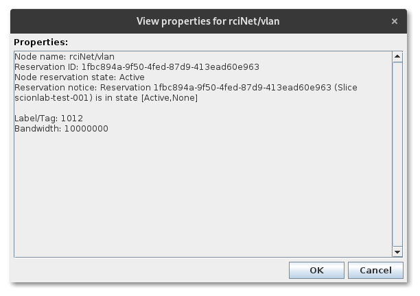

Alternatively, you can view a summary of all reservations under `Slice Operations` / `View Manifest as List`.

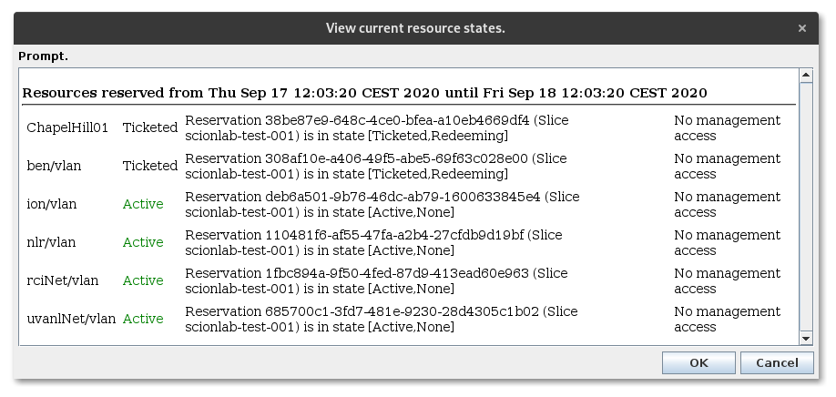

If something fails, contact the Fed4Fire support (contact provided by David).

## Configure Flukes Machines

!!! TODO
    scionlab user creation script with authorized_keys.

!!! Error
    Wait for Brecht to fix machines in NC, USA.
    Currently, the openstack controller is down and spin up of new VMs is not possible.

## Updating a Flukes Machine

You can set the GNU/Linux distribution release under `Edit Properties...` in the context menu of all machine nodes in the request graph of Flukes.

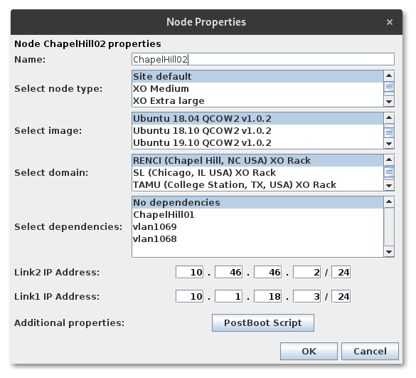

Alternatively, you can follow the instructions for a distribution upgrade from your preferred GNU/Linux distribution.

You can access the machines via SSH with the `scionlab` user over the link to VirtualWall. Please refer to the corresponding IP addresses in the [ScionLab Topology Overview](https://fin-ger.github.io/scionlab-fed4fire-topology/).

!!! TODO
    Check if ExoGeni machines survive a reboot
