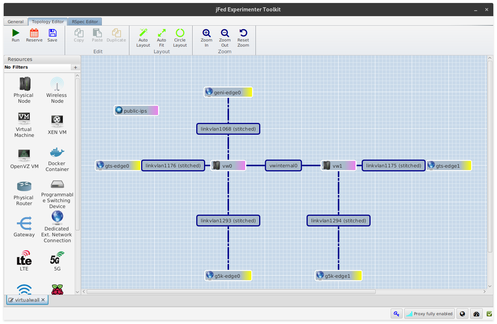
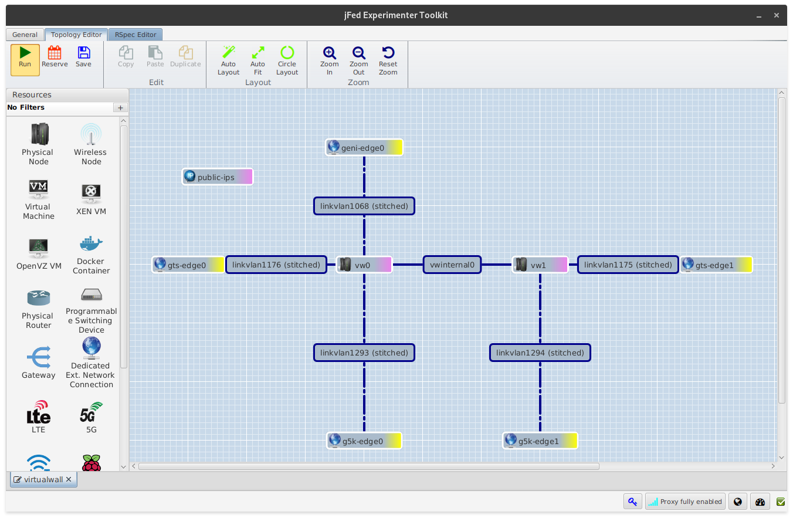

# VirtualWall

The VirtualWall testbed is deployed over Fed4Fire with the jFed tooling.

## Create a Fed4Fire Account

Visit [https://portal.fed4fire.eu/](https://portal.fed4fire.eu/) to register for a Fed4Fire account. Create a request to join the `scion` project and wait for approval.

## Setup jFed for Testbed Deployment

If the creation of your Fed4Fire account was successful, [download and install the jFed GUI](https://jfed.ilabt.imec.be/downloads/) on your system. Run the `experimenter-gui` and login with your Fed4Fire account:

```
$ java -jar experimenter-gui.jar
```


When login succeeds an empty jFed window should open up.


## Load the Testbed and Run it

In order to load up and run an experiment, open up the [ScionLab VirtualWall default configuration](../deployments/virtualwall.rspec) by clicking on `Open Local` in the toolbar. If successful, the following network configuration should show up:



To run the configuration, click on `Run` and set an experiment name.




!!! important "Tip"
    Always use a different experiment name to avoid hiccups with the jFed tooling.

It may take up to 15 minutes for an experiment to fully start. Take a coffee and be patient.

After some time all nodes and edges should eventually become green.


### View the Status of an Already Running Experiment

In jFed you can recover a running experiment by selecting the `Recover` button in the `General` tab. Select the desired experiment and start recovering it.


It will take a couple of minutes to query the status of a running experiment. Take a coffee and be patient.


## Configure VirtualWall Machines

To access a running machine, right-click on the node in the topology viewer and select `Open SSH terminal`. If this is not working, select `Show Node Info` and copy the contents of the `SSH` field into your terminal.

!!! warning
    Please note that when using this method you **must** have access to IPv6 addresses, as the VirtualWall servers are only accessible over IPv6. Alternatively, you can use an IPv4 proxy to access the nodes by setting it in the jFed preferences. See the [jFed documentation](https://doc.fed4fire.eu/firstexperiment.html) for details.


If you would like to access the machines over one of the external links to GTS or Grid5000, ssh on the machines with the `scionlab` user and the IP addresses provided in the [ScionLab Topology Overview](https://fin-ger.github.io/scionlab-fed4fire-topology/). The authentication is based on your public SSH key. If you don't have access to the machines but believe you should be able to access them, contact the ScionLab administrators.

## Updating a VirtualWall Machine

When right-clicking on a node in the `Topology Editor` you can configure a node's properties.


By clicking on the `+` next to the `Disk Image` field, you can choose a different GNU/Linux distribution for your node.


Alternatively, you can just run the normal distribution upgrade tools for your preferred GNU/Linux distribution.

!!! important "TODO"
    The machines survive a reboot, right?

## Creating Your Own Custom Testbed Configuration

!!! important "TODO"
    List common pitfalls here

 - configuration of Grid5000 nodes is not possible from within jFed as VLAN stitching is not supported via the Fed4Fire API
 - Stitching links to any other locations but VirtualWall1 or VirtualWall2 and external network edges is mostly not working
 - It is possible to create stitched links via a single VLAN to the ExoGeni nodes in UvA
    - However, no further connection is possible in UvA via jFed
 - InstaGeni nodes cannot be connected to any other testbed
